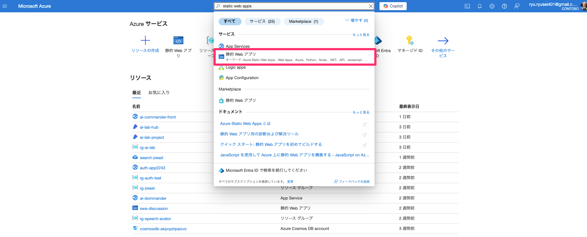
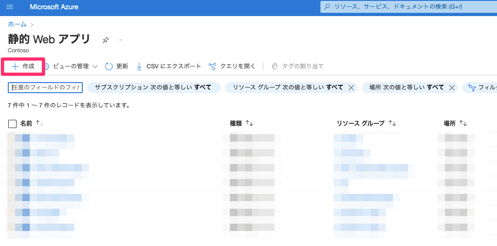
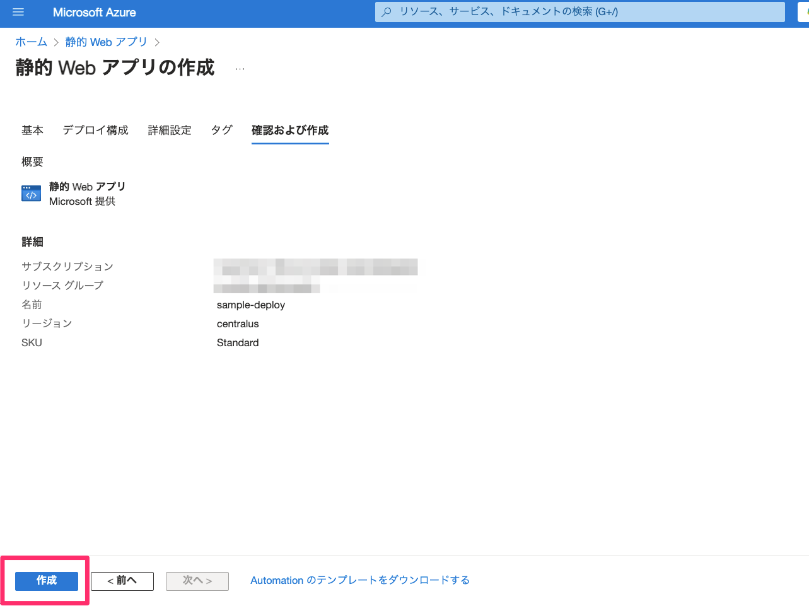
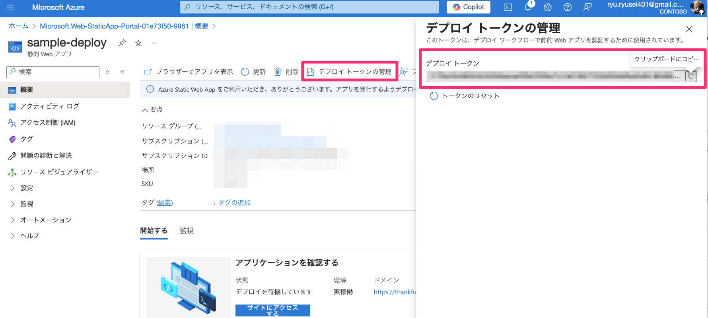

# Azure Static Web Apps デプロイ手順書

本ドキュメントでは、Azure Static Web Apps へのデプロイ手順をご説明します。

---

## 🔧 事前準備

以下の準備が必要です。

- **Azure アカウント**
- **Node.js (LTS バージョン)**：[インストール手順はこちら](https://nodejs.org/en/download)
- **Azure CLI**：[インストール手順はこちら](https://docs.microsoft.com/ja-jp/cli/azure/install-azure-cli)

---

## 🚀 Azure Static Web Apps の作成

以下の手順で、Azure Static Web Apps のリソースを作成します。

### ① Azure ポータルにログイン

Azure ポータルにログイン後、上部の検索バーに「静的 Web アプリ」と入力して検索します。



### ② 新しい Static Web Apps の作成

「静的 Web アプリ」を選択した後、表示されたページで「作成」ボタンをクリックします。



### ③ 必要な情報を入力

以下のように情報を入力後、「作成」をクリックします。

| 項目                           | 設定する値          |
|--------------------------------|-------------------|
| リソースグループ               | 任意（新規作成可） |
| 名前                           | 任意              |
| ホスティングプラン             | Standard          |
| デプロイ認可ポリシー           | デプロイトークン   |
| Azure Functionsとステージングの詳細 | 任意   |



作成完了まで数分かかります。

---

## 🌐 Azure Static Web Apps へのデプロイ

作成した Azure Static Web Apps に、アプリケーションをデプロイします。

### ① Azure Static Web Apps CLI をインストール

ターミナル（またはコマンドプロンプト）を開き、次のコマンドを実行します。

```bash
npm install -g @azure/static-web-apps-cli
```

### ② Azure Static Web Apps CLI でログイン

以下を実行し、Azureにログインします。

```bash
swa login --no-use-keychain
```

### ③ プロジェクトの初期化

次のコマンドを実行して初期化します。

```bash
swa init
```

以下のようなプロンプトが表示されるため、任意の名前を設定します。

```bash
✔ Choose a configuration name: （任意の名前を入力）
? Are these settings correct?:  Yes
```

### ④ デプロイトークンの取得

Azure ポータルで作成済みの Static Web Apps を選択し、「デプロイトークンの管理」をクリックします。

表示されたデプロイトークンをコピーしてください。



### ⑤ デプロイの実施

以下のコマンドを実行してデプロイします。`<デプロイトークン>`の箇所には、取得したデプロイトークンを貼り付けてください。

```bash
swa deploy --env production --app-location ./ --deployment-token <デプロイトークン>
```

正常に完了すると、以下のようなメッセージが表示されます。

```bash
Deploying project to Azure Static Web Apps...
✔ Project deployed to <ハンズオンのURL> 🚀
```

表示されたURLにブラウザからアクセスし、ページが表示されればデプロイ成功です。

---

## 🌟 ローカル環境での動作確認（オプション）

以下の方法でローカル環境で動作確認ができます。

### ① パッケージをインストール

```bash
npm install
```

### ② ローカルサーバーを起動

```bash
npm run serve
```

ブラウザで `http://localhost:1313/` にアクセスし、ページが表示されれば成功です。


---


