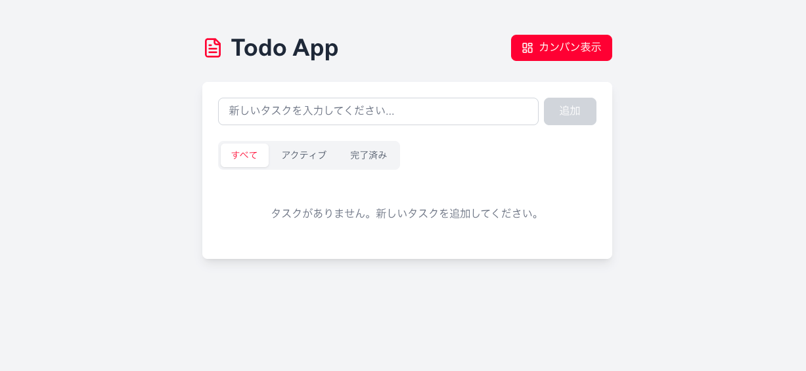
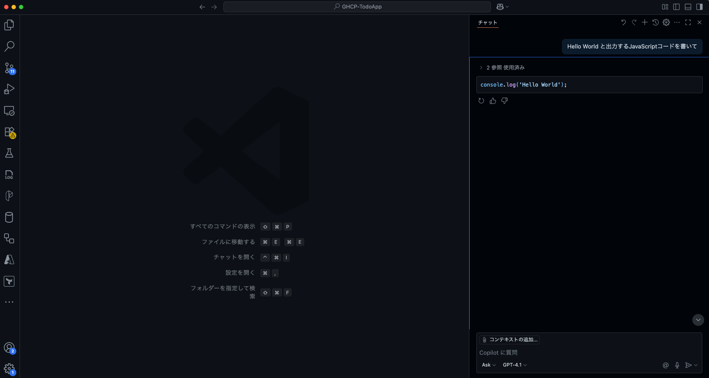

本ハンズオンでは、VS Code と GitHub Copilot の拡張機能が使用できる必要があります。
基本的に説明は VS Code をベースに行います。

## 前提条件

本ハンズオンを実施するために、以下の環境をご準備ください：

### 必要なソフトウェア
- **VS Code**: 最新版をインストールしてください
  - [公式サイト](https://code.visualstudio.com/)からダウンロード・インストール
- **GitHub Copilot ライセンス**: 有効な GitHub Copilot ライセンス
- **Node.js**: バージョン 20.x.x 以上
  - [公式サイト](https://nodejs.org/)からLTS版をダウンロード・インストール
  - インストール後、ターミナルで `node --version` を実行してバージョンを確認
- **パッケージマネージャー**: pnpm（推奨）または npm
  - pnpmの場合: `npm install -g pnpm` でインストール
  - npmはNode.jsインストール時に自動的にインストールされます


## 動作確認

### 1. GHCP-TodoApp の立ち上げ確認

まず、サンプルアプリケーション（GHCP-TodoApp）をGitHubからクローンして正常に動作するか確認しましょう：

```bash
# 1. リポジトリのクローン
git clone https://github.com/marumaru1019/GHCP-Handson-App.git

# 2. プロジェクトディレクトリに移動
cd GHCP-Handson-App

# 3. 依存関係のインストール
pnpm install
# または npm install

# 4. 開発サーバーの起動
pnpm dev
# または npm run dev
```


ブラウザで [http://localhost:3000](http://localhost:3000) にアクセスして、Todoアプリケーションが表示されることを確認してください。

**ハンズオン準備**: アプリケーションの動作確認ができたら、VS Codeでプロジェクトを開いておきましょう：

```bash
# VS Codeでプロジェクトを開く
code .
# または、別のターミナルから
code GHCP-Handson-App
```

> **📝 重要**
>
> このGHCP-Handson-Appプロジェクトをベースにハンズオンを進めていきます。
> VS Codeでプロジェクトが開かれ、GitHub Copilotが利用できる状態になっていることを確認してください。

### 2. GitHub Copilot のセットアップと動作確認

GitHub Copilotが正常に動作するか確認しましょう：

#### サインインの確認
1. **ステータスバーのCopilotアイコンを確認**
   - VS Code画面下部のステータスバーにあるCopilotアイコンにカーソルを合わせる
   - 「Set up Copilot」が表示される場合は、クリックしてセットアップを開始


2. **GitHubアカウントにサインイン**
   - 「Sign in」を選択してGitHubアカウントでサインイン
   - 既にサインイン済みの場合は「Use Copilot」が表示される
   - ブラウザでGitHub認証を完了させる


3. **サインイン状態の確認**
   - ステータスバーのCopilotアイコンが有効（アクティブ）状態になる
   - アクティビティバーの「アカウント」メニューでGitHubアカウントが表示される

#### チャット機能の動作確認
1. **Copilot Chatを開く**
   - `Ctrl+Shift+I`（Windows/Linux）または `Cmd+Shift+I`（Mac）でチャットパネルを開く
   - またはアクティビティバーのチャットアイコンをクリック

2. **動作テスト**
   - チャット入力欄に「Hello World と出力するJavaScriptコードを書いて」などと入力
   - Enterキーを押して送信
   - Copilotからコードが返答されることを確認




---
