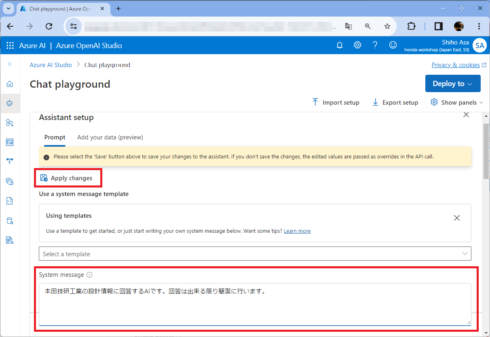
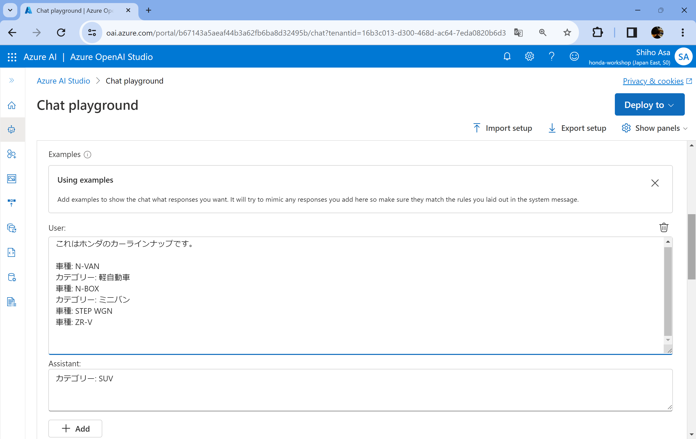
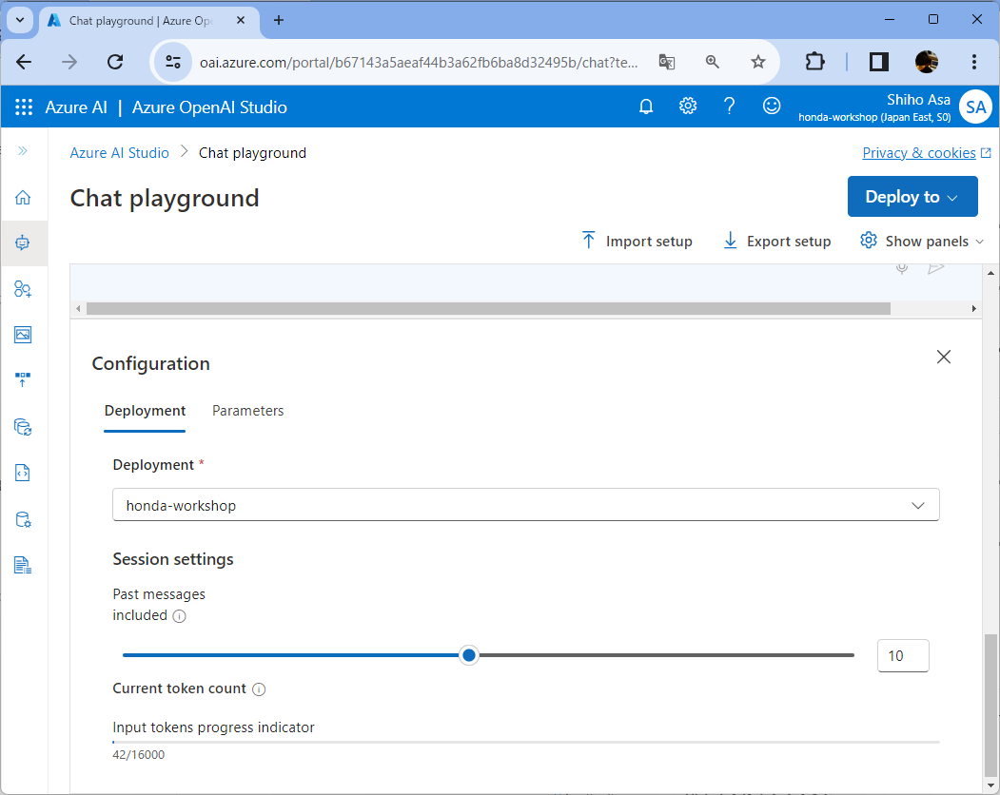
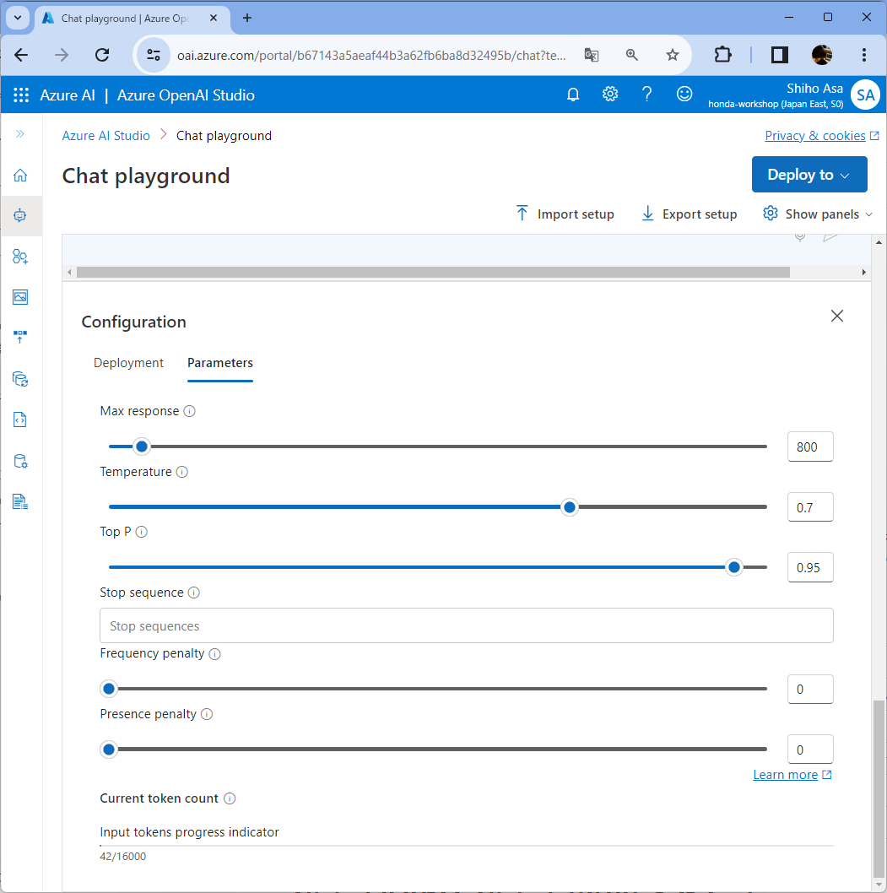

このワークショップでは、**「Azure OpenAI Studio」** と **「Bing Chat Enterprise」** を使用します。以下の手順でブラウザから利用できるかを確認してください。

## 1. Azure OpenAI Studioの場合
ワークショップを始める前に、お使いの端末のブラウザから[Azure OpenAI Studio](https://oai.azure.com/)にアクセス出来ることを確認します。

 [Azure OpenAI Studio](https://oai.azure.com/)
   を開き、[Chat playground]にアクセスします。

Azure OpenAI Studio の **[Chat playground]** にプロンプトを入力し、送信すると、生成AIが返答します。

チャットを削除したいときは、 **[Clear Chat]** ボタンをクリックします。

### モデルのふるまい設定
**「Assistant setup」**では、AI アシスタントがどのように振る舞うべきかを設定できます。複数のテンプレートが用意されており、デフォルト設定では、システムメッセージは「You are an AI assistant that helps people find information.」となっています。

この設定を変更するには、[System message]に新しいメッセージを入力します。たとえば「本田技研工業の設計情報に回答するAIです。回答は出来る限り簡潔に行います。」など、AIアシスタントの役割に合わせたメッセージを入力してください。

システムメッセージを変更したら、 **[Apply Changes]** ボタンをクリックして設定を保存します。

例を設定することで、より精度の高い回答を得ることができます。このように出力してほしい、などのフォーマットの例を追加したら、 **[+Add]** ボタンをクリックして設定を保存します。

### パラメータの設定
利用するモデルやパラメータを変更したいときは **[Configuration]** で設定します。

**[Deployment]** タブでは、利用するモデルやセッションに含めるメッセージを設定できます。

最大のトークン数やTemperature /Top_Pの値を変更したいときは、 **[Parameters]** タブで設定します。また、モデルの応答を任意の位置で終了させたいときは、 **[Stop sequence]** を設定します。この停止シーケンスは4つまで含めることができます。

長い文章を試したいときは **[Max response]** の値を大きくしてください。最大値はモデルによって異なります。

詳細については、[Azure OpenAI Service モデル](https://learn.microsoft.com/ja-jp/azure/ai-services/openai/concepts/models)を確認してください。

>  [Azure OpenAI Studio](https://oai.azure.com/)にアクセスできない場合は、 [OpenAI社 ChatGPT](https://www.bing.com/)を利用してワークショップを行うことも可能です。ただし、プロンプトに **絶対に機密情報を含めない** よう細心の注意してください。

## 2. BingChat Enterprise の場合
お使いの端末のブラウザから[BingChat Enterprise](https://www.bing.com/search?q=Bing+AI&showconv=1)にアクセス出来ることを確認します。

チャットを削除したいときは、 **[新しいトピック]** ボタンをクリックします。

