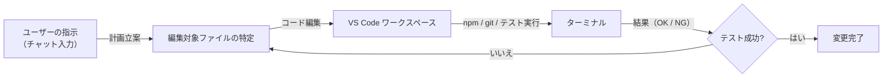

## 1. エージェントモード とは？

> **概要：** チャット欄にご要望を入力するだけで、GitHub ### :memo: 練習

以下の演習で Agent mode の理解を深めましょう：

1. **簡単なUI改善**
   「GHCP-TodoAppのボタンにホバー効果とアニメーションを追加してください」

2. **入力バリデーション追加**
   「Todo追加時に空文字や重複チェックを行い、エラーメッセージを表示してください」

3. **キーボードショートカット追加**
   「Ctrl+Enterで新しいTodo追加、Escapeで編集キャンセルできるようにしてください」

> **💡 コツ**: GHCP-TodoAppは既存の機能が充実しているので、小さな改善から始めて段階的に機能拡張していくと効果的です。コードの改修・依存追加・テスト実行**まで自動で実施し、エラーがあれば自ら再修正まで行うモードです。

例えば、

* *「`/api/hello` という API を新規作成してください」*
* *「ログイン判定フラグ `isLoggedIn` を `isUserAuthenticated` に書き換え、テストをパスさせてください」*

と入力すると Copilot が以下を繰り返します。

1. 変更対象ファイルの特定と編集。
2. 必要な CLI 実行（例：`npm install`, `npm test`）。
3. 失敗時のコード再編集。

最終的に **テストが成功する状態** まで自動で到達します。

---

## 2. 処理フロー（全体像）

下図は Agent mode がリクエストを処理する流れです。



> **ポイント**
>
> * **計画立案**：Copilot が指示内容から「どのファイルをどう直すか」を決定。
> * **自己回復**：テスト失敗時は自動で原因を特定し、再編集を試行。
> * **ゴール**：テスト成功後、差分をお客様に提示し採否を委ねます。

---

## 3. 導入前の設定

`settings.json` へ次の設定を追加いただくだけでご利用になれます。

```jsonc
{
  "chat.agent.enabled": true,
  "github.copilot.chat.agent.autoFix": true // 推奨
}
```

必要に応じて以下もご調整ください。

| 設定キー                                 | 役割                               | 推奨値  |
| ------------------------------------ | -------------------------------- | ---- |
| `chat.agent.maxRequests`             | 1 リクエスト内の最大試行回数                  | 10   |
| `github.copilot.chat.agent.runTasks` | `tasks.json` の build / test 自動実行 | true |

---

## 4. 具体的な使用例

### :pen: 例題 1 - 機能追加（作成日時表示）

GHCP-TodoApp に作成日時表示機能を追加してみましょう。

```text
Todoアイテムに作成日時を「〇分前」「〇時間前」形式で表示する機能を追加してください。既存のcreatedAtプロパティを活用し、日本語表示にしてください
```

### :robot: 出力例 1

Copilot が以下の処理を自動実行します：

1. `lib/dateUtils.ts` に相対時間表示のユーティリティ関数を作成
2. `TodoItem.tsx` に作成日時表示コンポーネントを追加
3. 日本語での時間表示ロジックを実装
4. `npm test` を実行してテストが通ることを確認

最終的に以下のような日時表示機能が追加されます：

```tsx
// lib/dateUtils.ts の一部
export const getRelativeTime = (date: Date): string => {
  const now = new Date();
  const diffMs = now.getTime() - date.getTime();
  const diffMins = Math.floor(diffMs / (1000 * 60));

  if (diffMins < 1) return 'たった今';
  if (diffMins < 60) return `${diffMins}分前`;
  if (diffMins < 1440) return `${Math.floor(diffMins / 60)}時間前`;
  return `${Math.floor(diffMins / 1440)}日前`;
};
```

### :pen: 例題 2 - 実装変更（型定義の変更による関連箇所の自動修正）

Todo型の`text`プロパティを`title`に変更して、全体の整合性を保ちましょう。

```text
Todo型のtextプロパティをtitleに変更してください。関連するすべてのコンポーネント、テスト、型定義を自動で更新し、テストが通るようにしてください
```

### :robot: 出力例 2

Copilot が以下の処理を自動実行します：

1. `src/types/shared/todo.ts` の Todo インターフェースを更新
2. `TodoApp.tsx` の state 管理とロジック部分を更新
3. `TodoItem.tsx` のプロパティ使用箇所を更新
4. `TodoInput.tsx` の新規Todo作成部分を更新
5. 関連する全テストファイルのモックデータとアサーションを更新
6. `npm test` 実行 → TypeScriptエラーを修正 → 再テスト → 全テスト合格

処理完了後のログ例：

```
Copilot> Updated Todo interface: text → title
Copilot> Modified TodoApp.tsx for new property name
Copilot> Updated TodoItem.tsx render logic
Copilot> Updated TodoInput.tsx todo creation
Copilot> Modified 4 test files with new property names
Copilot> Running npm test…
✓ 15 passing (2.3s)
```

---

### :memo: 練習

以下の演習で Agent mode の理解を深めましょう：

1. **簡単なUI改善**
   「GHCP-TodoAppのボタンにホバー効果とアニメーションを追加してください」

2. **入力バリデーション追加**
   「Todo追加時に空文字や重複チェックを行い、エラーメッセージを表示してください」

3. **キーボードショートカット追加**
   「Ctrl+Enterで新しいTodo追加、Escapeで編集キャンセルできるようにしてください」

> **💡 コツ**: GHCP-TodoAppは既存の機能が充実しているので、小さな改善から始めて段階的に機能拡張していくと効果的です。

---

## 5. 変更のレビューと確定方法

| 操作        | 実行方法                                  | 結果           |
| --------- | ------------------------------------- | ------------ |
| 採用        | `Keep`                                | 変更を確定        |
| 却下        | `Undo`                                | 元に戻す         |
| 一括採用／却下   | Chat ビュー `Accept All` / `Discard All` | 全変更をまとめて処理   |
| 直前リクエスト取消 | `Undo Last Edit` ↩︎                   | 直前の変更を全て巻き戻し |
| 取消の再適用    | `Redo Last Edit` ↪︎                   | 巻き戻した変更を再適用  |

---

## 6. まとめ

* Agent mode は **チャット指示だけでコード改修〜検証まで自動化** する生産性向上機能です。
* **複数ファイル編集**と**CLI 実行**が一体化しているため、大規模改修でも開発者はレビューに集中できます。
* ご利用は `chat.agent.enabled` を `true` に設定するだけ。ぜひお試しください。

