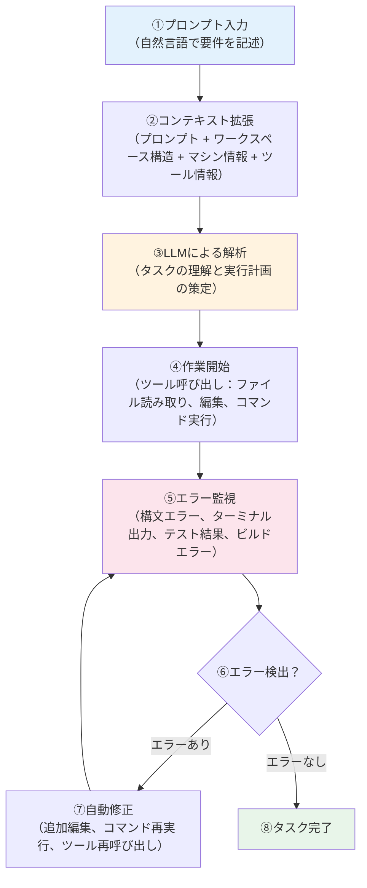

## 1. エージェントモード とは？

GitHub Copilot の3つのモード（Ask、Edit、Agent）の中で最も強力なモードです。高レベルの指示を渡すと、Copilot が自律的に手順を計画し、適切なファイルを選択し、複数のステップにわたってタスクを完了まで実行します。

**Agent モードの特徴**：

* **自律的な実行**: 単一の指示から複数のファイル編集を計画・実行
* **プロジェクト全体の理解**: 関連ファイルを自動的に特定し、整合性を保つ
* **継続的な実行**: 各ステップでの承認を待たずに目標達成まで実行

例えば、「Todo型のtextプロパティをtitleに変更してください」と指示すると、型定義だけでなく、関連するすべてのコンポーネントとテストファイルを自動で更新します。

---

## 2. Agent モードの動作特性

Agent モードは、複数のツールと変数を統合的に活用する**オーケストレーター**として機能します。システムプロンプトを通じて、Copilot は最終目標に到達するまで自身の出力を継続的に改善し続けます。

### Agent モードの内部動作フロー

Agent モードに自然言語のプロンプトを送信すると、以下のステップで処理が実行されます：



#### ステップ詳細

**① プロンプト入力**
- ユーザーが自然言語で求める最終結果を明確に記述
- 例：「Todo アイテムに優先度フィルター機能を追加してください」

**② コンテキスト拡張**
- バックエンドシステムがプロンプトを補強：
  - ユーザーのクエリ
  - ワークスペース構造の要約
  - マシンコンテキスト（OS、環境変数など）
  - 利用可能なツールの説明

**③ LLM による解析**
- AI 言語モデルがタスクを解釈し、実行方法を決定
- 必要なステップとツールの使用順序を計画

**④ 作業開始**
- 以下のような組み込みツールを自律的に使用：
  - `read_file`: ファイル内容の読み取り
  - `edit_file`: ファイルの編集
  - `run_in_terminal`: ターミナルコマンドの実行
  - その他、ワークスペース検索や情報取得ツール

**⑤ エラー監視**
- コマンド実行後や編集適用後、以下を自動検出：
  - 構文エラー（Syntax Errors）
  - ターミナル出力のエラーメッセージ
  - テスト実行結果の失敗
  - ビルドエラー

**⑥-⑦ エラー検出と自動修正**
- エラーが検出された場合、Agent モードは：
  - 追加のファイル編集を実行
  - ターミナルコマンドを再実行
  - 必要なツールを再度呼び出し
- このループは目標達成まで継続

**⑧ タスク完了**
- すべての検証が通過し、最終目標に到達

### Edit モードとの重要な違い

| 観点 | Edit モード | Agent モード |
|------|------------|-------------|
| **スコープ** | 指定ファイル・範囲のみ | プロジェクト全体の整合性を考慮 |
| **実行方法** | ステップごとに承認が必要 | 自動的に編集を適用し、継続実行 |
| **エラー対応** | 手動での修正が必要 | 自動検出・自動修正のループ |
| **制御レベル** | 開発者が各ステップを制御 | Copilot が「ドライバー」として自律実行 |

> **注意点**
>
> Agent モードは制御を一部 Copilot に委ねるため、予期しないファイルへの変更や想定と異なる実装方向に進むことがあります。変更内容は必ずレビューしてから確定しましょう。

---

## 3. 具体的な使用例


### :pen: 例題 1 - 機能追加（作成日時表示）

GHCP-TodoApp に作成日時表示機能を追加してみましょう。

```text
Todoアイテムに作成日時を「〇分前」「〇時間前」形式で表示する機能を追加してください。既存のcreatedAtプロパティを活用し、日本語表示にしてください
```

### :robot: 出力例 1

Copilot が以下の処理を自動実行します：

1. `lib/dateUtils.ts` に相対時間表示のユーティリティ関数を作成
2. `TodoItem.tsx` に作成日時表示コンポーネントを追加
3. 日本語での時間表示ロジックを実装
4. `npm test` を実行してテストが通ることを確認

最終的に以下のような日時表示機能が追加されます：

```tsx
// lib/dateUtils.ts の一部
export const getRelativeTime = (date: Date): string => {
  const now = new Date();
  const diffMs = now.getTime() - date.getTime();
  const diffMins = Math.floor(diffMs / (1000 * 60));

  if (diffMins < 1) return 'たった今';
  if (diffMins < 60) return `${diffMins}分前`;
  if (diffMins < 1440) return `${Math.floor(diffMins / 60)}時間前`;
  return `${Math.floor(diffMins / 1440)}日前`;
};
```

【実装された画面】


### :pen: 例題 2 - コード解説（Todoタスク追加処理の流れ）

GHCP-TodoAppでタスクを追加するときの内部処理を詳しく解説してもらいましょう。

```text
GHCP-TodoAppでタスクを追加するときに実際にどのような処理で行われているか解説してください。コードの流れやコンポーネント間の連携も含めて詳しく説明してください
```

### :robot: 出力例 2

Copilot が以下のような詳細な解説を提供します：

1. **ユーザー入力からTodo追加までの流れ**
   - `TodoInput.tsx` でのフォーム送信イベント処理
   - 入力値のバリデーションとサニタイゼーション
   - 新しいTodoオブジェクトの生成（id、createdAt等）

2. **状態管理とコンポーネント間連携**
   - `TodoApp.tsx` の `addTodo` 関数の動作原理
   - React useState による状態更新メカニズム
   - Todoリストのre-renderingプロセス

3. **実際のコード例とフロー図**
   ```typescript
   // TodoInput.tsx での処理例
   const handleSubmit = (e: FormEvent) => {
     e.preventDefault();
     if (text.trim()) {
       onAddTodo({
         id: Date.now().toString(),
         text: text.trim(),
         completed: false,
         createdAt: new Date()
       });
       setText('');
     }
   };
   ```

4. **パフォーマンス考慮点とベストプラクティス**
   - key propによるReact要素の効率的な更新
   - 不要なre-renderを避けるための最適化手法

解説完了後、関連するコードファイルへのリンクや追加の技術的詳細も提供されます。

---

## 4. 変更のレビューと確定方法

| 操作        | 実行方法                                  | 結果           |
| --------- | ------------------------------------- | ------------ |
| 変更内容の確認        | `↑↓`                                | 変更前と後の差分を確認        |
| ファイルごとの採用        | `保持`                                | 変更を確定        |
| ファイルごとの却下        | `元に戻す`                                | 元に戻す         |
| 一括採用／却下   | Chat ビュー `保持` / `元に戻す` | 全変更をまとめて処理   |
| 直前リクエスト取消 | Chat ビューで`巻き戻しアイコン`                   | 直前の変更を全て巻き戻し |
| 取消の再適用    | Chat ビューで`やり直しアイコン`                   | 巻き戻した変更を再適用  |


---

### :memo: 練習

以下の演習で Agent mode の理解を深めましょう：

1. **簡単なUI改善**
   「GHCP-TodoAppのボタンにホバー効果とアニメーションを追加してください」

2. **入力バリデーション追加**
   「Todo追加時に空文字や重複チェックを行い、エラーメッセージを表示してください」

3. **キーボードショートカット追加**
   「Ctrl+Enterで新しいTodo追加、Escapeで編集キャンセルできるようにしてください」

> **💡 コツ**: GHCP-TodoAppは既存の機能が充実しているので、小さな改善から始めて段階的に機能拡張していくと効果的です。

## 5. まとめ

* Agent mode は **チャット指示だけでコード改修〜検証まで自動化** する生産性向上機能です。
* **複数ファイル編集**と**CLI 実行**が一体化しているため、大規模改修でも開発者はレビューに集中できます。
