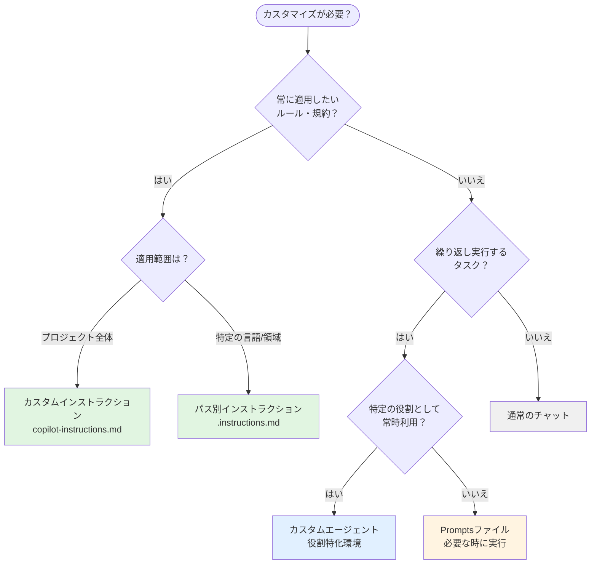

## 1. カスタマイズとは？

GitHub Copilot は、プロジェクトやチームの要件に合わせてカスタマイズできます。毎回同じコンテキストや指示を入力する代わりに、ファイルに保存して自動的に適用したり、再利用可能なプロンプトとして管理できます。

---

## 2. カスタマイズの種類

VS Code では以下の4つの方法でCopilotをカスタマイズできます：

| 種類 | 用途 | ファイル形式 | 適用タイミング |
|------|------|-------------|----------------|
| **カスタムインストラクション**<br>（`.github/copilot-instructions.md`） | プロジェクト全体の<br>コーディング規約 | Markdown | すべてのチャットに<br>自動適用 |
| **パス別インストラクション**<br>（`.instructions.md`） | 特定領域の<br>詳細なルール | Markdown<br>（Front Matter付き） | 条件に一致する<br>ファイル編集時 |
| **Promptsファイル**<br>（`.prompt.md`） | 再利用可能な<br>開発タスク | Markdown<br>（Front Matter付き） | 手動実行時<br>（`/プロンプト名`） |
| **カスタムエージェント**<br>（`.agent.md`） | 特定の役割や<br>タスクに特化した環境 | Markdown<br>（Front Matter付き） | エージェント選択時 |

---

## 3. 使い分けの指針

次のフローチャートを参考に、最適なカスタマイズ方法を選択してください。



## 4. カスタマイズの使い方

### 4.1 カスタムインストラクション（`.github/copilot-instructions.md`）

**作成方法:**
1. `github.copilot.chat.codeGeneration.useInstructionFiles` 設定を `true` に設定
2. ワークスペースルートに `.github` フォルダを作成（存在しない場合）
3. `.github/copilot-instructions.md` ファイルを作成
4. Markdown形式で指示内容を記述

**ファイル構造:**
```
プロジェクトルート/
├── .github/
│   └── copilot-instructions.md
└── ...
```

**例:**
```markdown
# Coding Guidelines

## 必須ルール
- すべてのファイルの冒頭に `// Created by GitHub Copilot` を記述する
- コメントは日本語で記述する
```

---

### 4.2 パス別インストラクション（`.instructions.md`）

**作成方法:**
1. **コマンドパレット**から `チャット: 手順の構成` を実行

1. または **チャットビュー**の「歯車アイコン」→「指示」→「新しい命令ファイル」

1. 保存場所を選択：
   - **Workspace**: `.github/instructions/` フォルダ（ワークスペース固有）
   - **User profile**: ユーザープロファイル（複数ワークスペース共通）
2. ファイル名を入力（例：`typescript.instructions.md`）

**ファイル構造:**
```
プロジェクトルート/
├── .github/
│   ├── copilot-instructions.md
│   └── instructions/
│       ├── backend.instructions.md
│       ├── frontend.instructions.md
│       └── testing.instructions.md
└── ...
```

**Front Matter の設定:**

| 項目 | 説明 | 例 |
|------|------|-----|
| `description` | 指示ファイルの説明文 | `"テスト作成時の指示"` |
| `applyTo` | 自動適用するファイルのglobパターン | `"**/*.test.ts,**/*.spec.ts"` |

**例:**
```markdown
---
description: "テストファイルのルール"
applyTo: "**/*.test.ts,**/*.spec.ts"
---

# テストファイルのルール

- テストファイルの冒頭に `// Test file` のコメントを追加する
- すべてのテストケースに日本語の説明を含める
```

このファイルを保存すると、テストファイル（`.test.ts`、`.spec.ts`）を編集する際に自動的に適用されます。

---

### 4.3 Promptsファイル（`.prompt.md`）

**使う場面:**
- コンポーネント生成などの定型作業を効率化したい
- コードレビューやセキュリティチェックを標準化したい
- 複雑なプロンプトを再利用したい
- パラメータ（変数）を使って柔軟に実行したい

**作成方法:**
1. **コマンドパレット**から `チャット: プロンプトファイルの構成` を実行

2. または **チャットビュー**の「歯車アイコン」→「プロンプト」→「新しいプロンプトファイル」

3. 保存場所を選択：
   - **Workspace**: `.github/prompts/` フォルダ（ワークスペース固有）
   - **User profile**: ユーザープロファイル（複数ワークスペース共通）
4. ファイル名を入力（例：`refactor-typescript.prompt.md`）

**ファイル構造:**
```
プロジェクトルート/
├── .github/
│   └── prompts/
│       ├── refactor-typescript.prompt.md
│       ├── code-review.prompt.md
│       └── security-check.prompt.md
└── ...
```

**Front Matter の設定:**

| 項目 | 説明 | 例 |
|------|------|-----|
| `mode` | チャットモード | `"agent"`, `"ask"`, `"edit"` |
| `model` | 使用するAIモデル | `"Claude Sonnet 4.5"` |
| `description` | プロンプトの説明文 | `"TypeScriptリファクタリング"` |
| `tools` | 使用可能なツール | `["editFiles", "problems"]` |

**例:**
````markdown
---
mode: agent
model: Claude Sonnet 4.5
description: "ファイルにヘッダーコメントを追加"
tools: ["editFiles"]
---

# ファイルヘッダー追加

開いているファイルの先頭に以下の形式のヘッダーコメントを追加してください：

```
// ========================================
// File: [ファイル名]
// Created: [今日の日付]
// ========================================
```
````

**プロンプトファイルの呼び出し方法:**

**方法1:** コマンドパレット → `チャット: プロンプトを実行`

**方法2:** チャット入力欄で `/` に続けてプロンプトファイル名を入力
```
/プロンプト名
```

---

### 4.4 カスタムエージェント（`.agent.md`）

> **⚠️ VS Code 1.106以降の機能**
>
> カスタムエージェントはVS Code 1.106以降で利用可能です。以前のバージョンでは「カスタムチャットモード」という名称で、ファイル拡張子は `.chatmode.md`、フォルダは `.github/chatmodes/` でした。VS Codeは既存の `.chatmode.md` ファイルも引き続き認識しますが、新規作成時は新しい形式（`.agent.md`、`.github/agents/`）を使用することを推奨します。

**使う場面:**
- 計画立案、レビュー、デバッグなど特定タスクに特化したい
- 使用できるツールを制限したい（安全性向上）
- タスクごとに異なるモデルを使いたい
- 素早くエージェントを切り替えたい
- エージェント間のワークフロー（handoffs）を構築したい

**作成方法:**
1. **コマンドパレット** → `Chat: New Custom Agent`

1. **保存場所を選択**:
   - **Workspace**: `.github/agents/` フォルダ（チーム共有）
   - **User Profile**: 個人設定（複数ワークスペースで使用）
2. **エージェント名を入力** （エージェントドロップダウンに表示される名前）
3. **ファイル内容を編集** （Front Matter + 指示内容）

**ファイル構造:**
```
プロジェクトルート/
├── .github/
│   └── agents/
│       ├── plan.agent.md
│       ├── review.agent.md
│       └── debug.agent.md
└── ...
```

**Front Matter の設定:**

| 項目 | 説明 | 例 |
|------|------|-----|
| `description` | エージェントの説明文 | `"実装計画を生成するエージェント"` |
| `name` | エージェント名（未指定時はファイル名） | `"Planner"` |
| `tools` | 使用可能なツール・ツールセット | `['codebase', 'search', 'usages']` |
| `model` | 使用するAIモデル | `Claude Sonnet 4.5` |
| `handoffs` | 他エージェントへの遷移ボタン定義 | 下記参照 |

**例（コメント追加エージェント）:**
```markdown
---
description: "コードに日本語コメントを追加"
name: "Comment Writer"
tools: ['codebase', 'editFiles']
model: "Claude Sonnet 4.5"
---

# コメント追加エージェント

あなたはコードに日本語コメントを追加する専門家です。

## ルール
- すべての関数に「この関数は〇〇を行う」という形式のコメントを追加
- 複雑なロジックには行内コメントで説明を追加
- コメントは必ず日本語で記述
```

**Handoffs（エージェント間ワークフロー遷移）:**

Handoffsを使用すると、エージェント間でシームレスにワークフローを繋げることができます。チャット応答の後にボタンが表示され、クリックすると次のエージェントに遷移します。

```markdown
---
description: "実装計画を生成"
tools: ['search', 'fetch']
handoffs:
  - label: "実装を開始"
    agent: implementation
    prompt: "上記の計画に基づいて実装を開始してください。"
    send: false
---
```

| handoffs項目 | 説明 |
|--------------|------|
| `label` | ボタンに表示するテキスト |
| `agent` | 遷移先のエージェント識別子 |
| `prompt` | 遷移先に送信するプロンプト |
| `send` | `true`で自動送信、`false`で入力欄に表示 |

**カスタムエージェントの管理:**

**チャットビューから:**
1. **チャットビュー** → **設定ボタン** → **Agents**
2. **既存エージェントを選択** して編集
3. **アクション**: コピー・移動・名前変更・削除

**コマンドパレットから:**
- `Configure Custom Agents` → エージェント選択 → 編集

---

## 5. :memo: 練習問題

以下の課題に取り組んで、カスタマイズの理解を深めましょう。

### 練習1: カスタムインストラクションの作成

`.github/copilot-instructions.md` を作成し、以下のルールを記述してください：

**内容:**
```markdown
# Coding Rules
- すべてのファイルの冒頭に「Created by GitHub Copilot」を記述
- 変数名は日本語のコメントで説明を追加
```

**確認方法:**
1. ファイルを保存
2. 新しいファイルを作成し、Copilot に「新しい関数を作成して」と依頼
3. ファイル冒頭にコメントが追加されることを確認

### 練習2: Promptsファイルの作成

`.github/prompts/add-header.prompt.md` を作成してください：

**内容:**
```markdown
---
mode: agent
description: "ファイルヘッダー追加"
tools: ["editFiles"]
---

開いているファイルの先頭に「Created: [今日の日付]」コメントを追加してください。
```

**確認方法:**
1. 任意のファイルを開く
2. チャットで `/add-header` を実行
3. ファイル先頭にコメントが追加されることを確認

### 練習3: カスタムエージェントの作成

コマンドパレットから `Chat: New Custom Agent` を実行し、以下の内容で作成してください：

**内容:**
```markdown
---
description: "説明追加エージェント"
tools: ['codebase', 'editFiles']
---

# 説明追加エージェント

すべての回答に「📝 説明：」という接頭辞を付けて、簡潔に説明してください。
```

**確認方法:**
1. エージェントを「説明追加エージェント」に切り替え
2. 「このプロジェクトについて教えて」と質問
3. 回答に「📝 説明：」が付くことを確認

---

## 6. よくある質問

### Q1: どれから始めればいい？

**A:** まずは**カスタムインストラクション**から始めましょう。プロジェクト全体の基本ルールを設定するだけで、すぐに効果が実感できます。

### Q2: ツールの優先順位は？

**A:** ツール指定の優先順位は以下の通りです：
1. **Promptsファイル** の `tools` 指定（最優先）
2. **カスタムエージェント** の `tools` 指定
3. 既定のツールセット

### Q3: チームで共有するには？

**A:** `.github/copilot-instructions.md` をバージョン管理に含めることで、チーム全体で共有できます。パス別インストラクション、Prompts、カスタムエージェントも同様にGitで管理可能です。

### Q4: ワークスペースとユーザープロファイルの違いは？

**A:**
- **ワークスペース**: プロジェクト固有の設定。`.github/copilot-instructions.md` はワークスペース専用です。
- **ユーザープロファイル**: 個人設定として複数ワークスペースで使用。パス別インストラクション、Prompts、カスタムエージェントはどちらにも保存可能です。


---

## まとめ

GitHub Copilot のカスタマイズは4つの方法があり、それぞれ異なる用途に最適化されています：

| 方法 | 主な用途 | 適用タイミング |
|------|----------|----------------|
| **カスタムインストラクション** | プロジェクト全体のルール | 常時自動適用 |
| **パス別インストラクション** | 特定領域の詳細ルール | 条件付き自動適用（globパターン） |
| **Promptsファイル** | 再利用可能な開発タスク | 手動実行（`/プロンプト名`） |
| **カスタムエージェント** | 役割・タスク特化の環境 | エージェント選択時 |

**使い分けの核心:**
- **カスタムインストラクション**: 常に守るべき「プロジェクト全体のルール・規約」
- **パス別インストラクション**: 特定ファイルにのみ適用する「詳細ルール」
- **Promptsファイル**: 必要な時に使う「単発タスク」（ツール指定は**最優先**）
- **カスタムエージェント**: 役割を固定する「ペルソナ・ワークフロー」

**成功のポイント:**
- **段階的導入**: カスタムインストラクションから始めて徐々に拡充
- **適切な使い分け**: フローチャートを参考に最適な方法を選択
- **ツール優先度の理解**: Prompt file ＞ カスタムエージェント ＞ 既定
- **チーム標準化**: バージョン管理で共有し、チーム全体で活用