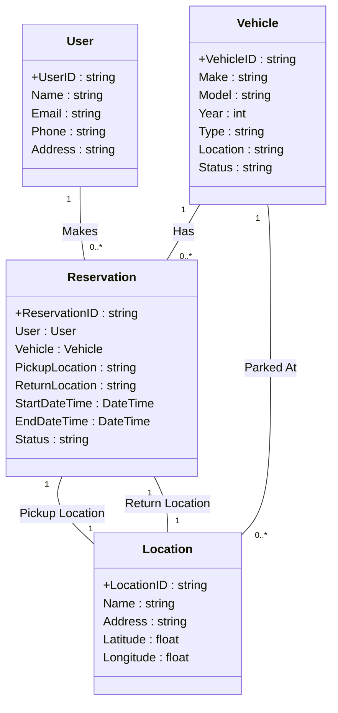
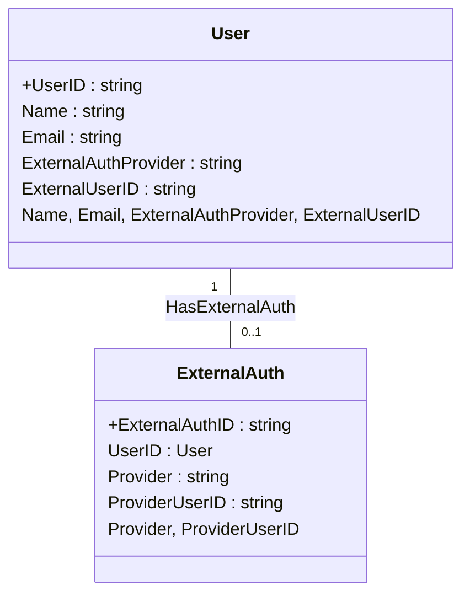
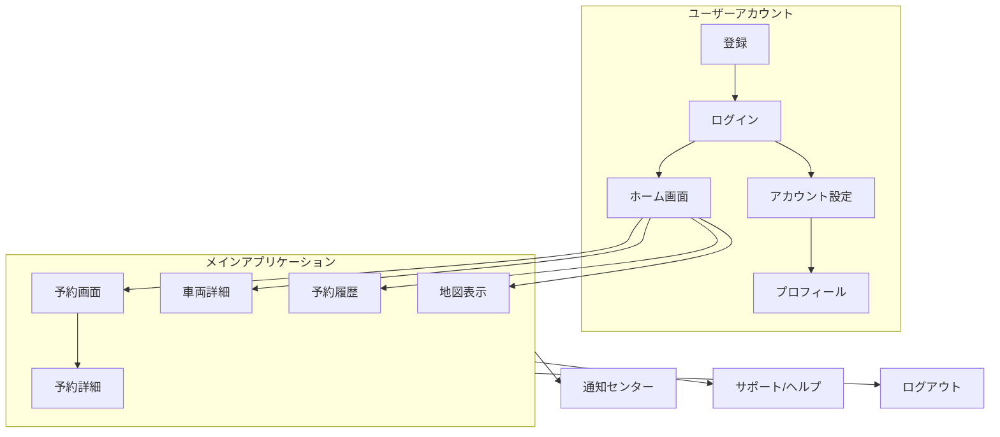

ChatGPTを使って「シェアリングカーの予約システム」の開発を行います。1つずつ質問をしながら、どのような結果が得られるのかを確認してください。


> この画像はBing Chatを使って`「HONDAの車を使ったシェアリングカーのサービスを始める予定です。HPに掲載する画像を生成してください。スタイリッシュでオシャレな感じでお願いします。」`というプロンプトで生成したものです

--- 
### :memo: 1. ユースケースの作成
```text
シェアリングカーの予約のシステムが必要です。どんなユースケースが考えられますか?
```

#### :robot: 出力例
シェアリングカーの予約システムを開発する場合、以下のようなユースケースを考えることができます：

1. **カー共有利用者の新規登録:** 利用者がシステムに登録し、プロフィール情報や運転免許証のアップロードを行うことができる。

2. **車両の登録:** シェアリングカーの所有者が自分の車両を登録し、車両の情報、写真、可用性などを提供できる。

3. **予約の作成:** 利用者が特定の日時に車両を予約できる。予約の際に出発場所、到着場所、利用時間などを指定する。

4. **予約の変更とキャンセル:** 予約済みの車両の出発時間や場所を変更したり、予約をキャンセルしたりするオプションが提供される。

5. **車両の検索:** 利用者が特定の場所や日時に利用可能な車両を検索できる。

6. **支払い処理:** 予約の際に支払い情報を入力し、利用料金が請求される。

7. **キーの受け渡し:** 予約された車両のキーの受け渡し方法を決定し、利用者と所有者間でキーを交換できる。

8. **車両の状態と清掃:** システムを通じて車両の状態を報告し、清掃が必要な場合に通知できる。

9. **評価とレビュー:** 利用者が車両所有者や他の利用者に対して評価とレビューを投稿できる。

10. **サポートと問い合わせ:** 利用者がシステム運営者に問い合わせやサポートを求める手段が提供される。

11. **ドライバーの確認:** 運転免許証などのドライバーの身分証明書を確認し、ドライバーの資格を確認する手続きを実施できる。

12. **予約履歴と請求書:** 利用者は過去の予約履歴や請求書を確認できる。

13. **タイムスロット管理:** 車両所有者が特定の時間帯に車両を利用できるようにタイムスロットを設定できる。

14. **GPSトラッキング:** 利用者が車両の場所をリアルタイムで確認でき、所有者が車両を見つけやすくなる。

15. **イベントとプロモーション:** 利用者に対してイベントやプロモーションを通知し、特別割引を提供できる。

これらのユースケースを考慮に入れ、使いやすく安全なシェアリングカーの予約システムを開発することが重要です。また、法的および規制上の要件も確認し、システムが適切に運用されるようにする必要があります。


--- 
### :memo: 2. データモデルの作成
```text
これらのユースケースをシステムとして実現するために、どの様なデータモデルが考えられますか? Mermaid live editor で表示できる書式で作成してください。
```

#### :robot: 出力例
シェアリングカーの予約システムを実現するためのデータモデルをMermaid記法で示します。以下は、基本的なエンティティとその関連性を表すデータモデルの例です。



--- 
### :memo: 3. エンティティの表示
```text
エンティティのデータの例を表形式で出力してください。
```

#### :robot: 出力例
以下に、エンティティのデータの例を表形式で示します。これは、データモデル内の主要なエンティティ（ユーザー、車両、予約、場所）の例です。

**User (ユーザー)**

| UserID | Name       | Email                | Phone        | Address              |
|--------|------------|----------------------|--------------|----------------------|
| U1     | John Doe   | johndoe@example.com  | +1234567890  | 123 Main St, City   |
| U2     | Jane Smith | janesmith@example.com | +9876543210  | 456 Elm St, Town    |

**Vehicle (車両)**

| VehicleID | Make    | Model   | Year | Type    | Location | Status    |
|-----------|---------|---------|------|---------|----------|-----------|
| V1        | Honda   | Accord  | 2022 | Sedan   | Location1| Available |
| V2        | Honda   | Civic   | 2023 | Compact | Location2| InUse     |
| V3        | Honda   | Fit     | 2022 | Electric| Location3| Available |

**Reservation (予約)**

| ReservationID | User  | Vehicle | PickupLocation | ReturnLocation | StartDateTime       | EndDateTime         | Status   |
|--------------|-------|---------|----------------|----------------|---------------------|---------------------|----------|
| R1           | U1    | V1      | Location1      | Location2      | 2023-01-15 10:00 AM | 2023-01-15 02:00 PM | Active   |
| R2           | U2    | V3      | Location3      | Location1      | 2023-02-20 09:00 AM | 2023-02-20 04:00 PM | Active   |

**Location (場所)**

| LocationID | Name        | Address             | Latitude | Longitude |
|------------|-------------|---------------------|----------|-----------|
| Location1  | Downtown    | 123 Main St, City   | 40.7128  | -74.0060  |
| Location2  | Suburb      | 456 Elm St, Town    | 40.6782  | -73.9442  |
| Location3  | Airport     | 789 Skyport Rd, City| 40.6413  | -73.7781  |

これらの例データは、シェアリングカーの予約システムのエンティティに関連する情報を示しており、実際のデータベースやアプリケーション内で使用できる形式です。データベーステーブルやクラスの各行には固有の識別子（ID）が含まれ、エンティティ間の関連を確立します。

--- 
### :memo: 4. ログインの実装
```text
ログインは、自分たちでお客様のログイン情報を持ちたくありません。
メールやソーシャル連携などで実現したいです。
その際のユースケースやデータモデルでは、どんな変更をしたら良いですか?
```

#### :robot: 出力例
ユーザー認証を外部サービス（メールやソーシャル連携）を使用して実現する場合、データモデルとユースケースにいくつかの変更が必要です。以下に、変更点と新しいユースケースを示します。

ユーザー認証情報の削除: パスワードなどのユーザー認証情報は、外部認証プロバイダーを使用する場合に不要になるため、データモデルからこれらの情報を削除できます。

外部認証プロバイダーの統合: メール認証やソーシャル連携のために、外部認証プロバイダーとの統合が必要です。この統合には、APIキーの設定や認証フローの実装が含まれます。

ユーザーの外部認証情報のリンク: ユーザーがアカウントを作成する際、外部認証プロバイダー（例：Google、Facebook、Twitter、メールアドレス）とリンクする方法を提供する必要があります。これにより、ユーザーは外部アカウントを使用してログインできるようになります。

ユーザーのプロファイル情報: ユーザーのプロファイル情報（名前、メールアドレスなど）を外部認証プロバイダーから取得し、データモデルに保存する必要があります。この情報は、ユーザーのアカウントに関連付けられます。

新しいユーザーサインアップ: ユーザーが初めてアプリにアクセスする際、外部認証プロバイダーを使用してサインアップするユースケースを追加する必要があります。

以下は、外部認証を使用する場合のデータモデルとユースケースの変更を示すMermaid形式のコードの例です。以下の例では、ユーザーがGoogleアカウントを使用してログインする場合を考慮しています。



上記のデータモデルでは、Userエンティティには外部認証プロバイダー（例：Google）から提供された情報をリンクするための属性（ExternalAuthProviderおよびExternalUserID）が含まれています。ExternalAuthエンティティは外部認証プロバイダーとの関連を管理します。

このデータモデルに従って、ユーザーは外部認証プロバイダーを使用してアプリにアクセスでき、そのプロバイダーから提供された情報がデータモデルにリンクされます。ログインや新規登録時には、外部認証プロバイダーから提供された情報を使用してユーザーを特定し、アプリケーション内の機能にアクセスできます。

--- 
### :memo: 5. 画面の作成
```text
このシステムにはどんな画面が必要ですか? リストアップしてください。
```

#### :robot: 出力例
シェアリングカーの予約システムには、以下のような画面が必要とされるでしょう。これらの画面は、ユーザーがアプリケーションを使用して予約を行ったり、アカウントを管理したりするためのインターフェースとなります。

1. **ユーザー登録画面**: 新しいユーザーがアプリに登録するための画面。ユーザー情報や外部認証プロバイダーとの連携オプションを提供します。

2. **ログイン画面**: 既存のユーザーがアプリにログインするための画面。外部認証プロバイダーを選択してログインするオプションも含めることができます。

3. **ホーム画面**: ユーザーがシェアリングカーを検索し、予約を行うための中心的な画面。カーシークやフィルターオプション、利用可能な車両のリストなどが表示されます。

4. **車両詳細画面**: 特定の車両の詳細情報を表示し、車両の写真、仕様、料金、予約ボタンなどを提供します。

5. **予約画面**: ユーザーが車両を予約するための画面。日時、場所、予約期間を指定し、予約を確認および確定するオプションを提供します。

6. **予約履歴画面**: ユーザーの過去の予約のリストを表示し、予約の詳細とステータスを確認できる画面。

7. **アカウント設定画面**: ユーザーがアカウント情報を管理し、外部認証プロバイダーの設定を変更できる画面。

8. **通知センター**: 予約確認、キャンセル通知、アカウントの更新などの通知を一元管理する画面。

9. **場所選択画面**: 車両を受け取る場所と返却する場所を選択できる画面。

10. **予約詳細画面**: 予約の詳細情報を表示し、必要に応じて予約を編集またはキャンセルできる画面。

11. **支払い情報画面**: 予約料金の支払い情報を設定し、支払いプロセスを管理するための画面。

12. **サポート/ヘルプセンター**: ユーザーサポート情報、よくある質問（FAQ）、お問い合わせフォームなどを提供する画面。

13. **プロフィール画面**: ユーザーのプロフィール情報を表示し、必要に応じて編集できる画面。

これらの画面は、シェアリングカーの予約システムが提供する主要な機能をサポートし、ユーザーエクスペリエンスを向上させるのに役立ちます。アプリケーションのデザインと機能に合わせて、さらにカスタマイズや追加の画面を検討することもあります。


--- 
### :memo: 6. 画面遷移図
```text
ユーザーが操作する画面の画面遷移図を Mermaid live editor で処理できる書式で作成してください。
```

#### :robot: 出力例


--- 
### :memo: 7. エンティティの管理
```text
ユースケースを整理すると、エンティティの何を管理する仕組みが必要ですか?
```

#### :robot: 出力例
ユースケースを整理すると、以下のエンティティを管理する仕組みが必要です:

1. **ユーザー (User) の管理**:
   - ユーザーの登録と新規作成
   - ログインと認証
   - ユーザープロファイル情報の表示および更新
   - 外部認証プロバイダーとの連携

2. **車両 (Vehicle) の管理**:
   - 利用可能な車両のリスト表示
   - 車両詳細情報の提供
   - 車両の予約および利用状況の管理

3. **予約 (Reservation) の管理**:
   - 予約の作成と確認
   - 予約の更新、延長、キャンセル
   - 予約の詳細情報の表示
   - 予約ステータスの管理

4. **場所 (Location) の管理**:
   - 車両の受け渡し場所と返却場所のリスト表示
   - 地理的な場所情報の提供

5. **通知 (Notification) の管理**:
   - 通知の送信と受信
   - 通知の表示および通知センターの管理

6. **アカウント設定 (Account Settings) の管理**:
   - アカウント情報の表示と編集
   - 外部認証プロバイダーの設定
   - 支払い情報の管理

7. **サポート/ヘルプセンター (Support/Help Center) の管理**:
   - ユーザーサポート情報の提供
   - よくある質問 (FAQ) の表示
   - お問い合わせフォームの提供

これらの管理仕組みは、シェアリングカーの予約システムが提供する主要な機能を支えます。それぞれの仕組みは、対応するエンティティの情報を操作し、ユーザーがアプリケーションを効果的に利用できるようにします。アプリケーションの要件に合わせて、これらの管理仕組みを実装する必要があります。


--- 
### :memo: 8. SQL文の作成
```text
先ほどのデータモデルを Azure SQL Database に実装します。
テーブル作成のSQL文と、サンプルのデータを登録するSQL文を作成してください。
サンプルデータは3件以上作成してください。データは日本語でお願いします。
```

#### :robot: 出力例
Azure SQL Databaseにデータモデルを実装するためのテーブル作成のSQL文と、サンプルのデータを登録するSQL文を提供します。以下のSQLスクリプトは、データモデルのエンティティ（ユーザー、車両、予約、場所）のテーブルを作成し、サンプルのデータを登録するものです。サンプルデータには、HONDA車両の情報が含まれています。

```sql
-- ユーザーテーブルの作成
CREATE TABLE Users (
    UserID INT PRIMARY KEY,
    Name NVARCHAR(255),
    Email NVARCHAR(255),
    Phone NVARCHAR(20),
    Address NVARCHAR(255)
);

-- サンプルユーザーデータの登録
INSERT INTO Users (UserID, Name, Email, Phone, Address)
VALUES
    (1, N'山田太郎', N'yamada@example.com', N'1234567890', N'東京都渋谷区'),
    (2, N'鈴木花子', N'suzuki@example.com', N'9876543210', N'大阪府大阪市'),
    (3, N'田中次郎', N'tanaka@example.com', N'5555555555', N'京都府京都市');

-- 車両テーブルの作成
CREATE TABLE Vehicles (
    VehicleID INT PRIMARY KEY,
    Make NVARCHAR(50),
    Model NVARCHAR(50),
    Year INT,
    Type NVARCHAR(50),
    Location NVARCHAR(100),
    Status NVARCHAR(50)
);

-- サンプル車両データの登録 (HONDA車)
INSERT INTO Vehicles (VehicleID, Make, Model, Year, Type, Location, Status)
VALUES
    (1, N'Honda', N'Civic', 2022, N'コンパクト', N'東京', N'利用可能'),
    (2, N'Honda', N'Accord', 2023, N'セダン', N'大阪', N'利用中'),
    (3, N'Honda', N'Fit', 2022, N'コンパクト', N'京都', N'利用可能');

-- 予約テーブルの作成
CREATE TABLE Reservations (
    ReservationID INT PRIMARY KEY,
    UserID INT,
    VehicleID INT,
    PickupLocation NVARCHAR(100),
    ReturnLocation NVARCHAR(100),
    StartDateTime DATETIME,
    EndDateTime DATETIME,
    Status NVARCHAR(50)
);

-- サンプル予約データの登録
INSERT INTO Reservations (ReservationID, UserID, VehicleID, PickupLocation, ReturnLocation, StartDateTime, EndDateTime, Status)
VALUES
    (1, 1, 1, N'東京', N'大阪', '2023-01-15 10:00:00', '2023-01-15 14:00:00', N'有効'),
    (2, 2, 3, N'京都', N'東京', '2023-02-20 09:00:00', '2023-02-20 16:00:00', N'有効');

-- 場所テーブルの作成
CREATE TABLE Locations (
    LocationID INT PRIMARY KEY,
    Name NVARCHAR(100),
    Address NVARCHAR(255),
    Latitude DECIMAL(9, 6),
    Longitude DECIMAL(9, 6)
);

-- サンプル場所データの登録
INSERT INTO Locations (LocationID, Name, Address, Latitude, Longitude)
VALUES
    (1, N'ダウンタウン', N'東京都渋谷区', 35.6895, 139.6917),
    (2, N'サブーブ', N'大阪府大阪市', 34.6937, 135.5023),
    (3, N'空港', N'京都府京都市', 35.0116, 135.7681);
```

---
### :memo: 9. フロントエンドアプリケーションの実装
```text
アプリケーションは SPAのWebアプリケーションにします。
Webクライアントは、Reactを使います。WebサーバーはPythonで実装します。
先ほどのユースケースの以下の画面のコードを書いてください。

- ユーザー登録画面
```

#### :robot: 出力例
ユーザー登録画面をSPA（Single Page Application）として実装するために、Reactを使用して、PythonのWebサーバーと連携する必要があります。以下は、Reactを使ったユーザー登録フォームのコードの例です。このコードはフロントエンドの一部で、実際のWebサーバーとの連携が必要です。

まず、Reactアプリケーションを作成します。以下のコマンドを使用して、新しいReactプロジェクトを作成します。

```bash
npx create-react-app user-registration-app
cd user-registration-app
```

ユーザー登録フォームのコンポーネントを作成します。新しいコンポーネントファイル（UserRegistration.js）を作成し、次のようにコードを記述します。

```javascript
import React, { useState } from 'react';

function UserRegistration() {
  const [name, setName] = useState('');
  const [email, setEmail] = useState('');
  const [password, setPassword] = useState('');

  const handleSubmit = (e) => {
    e.preventDefault();

    // ここでユーザー登録のロジックを実装
    const userData = {
      name,
      email,
      password,
    };

    // データをサーバーに送信
    fetch('/api/user-registration', {
      method: 'POST',
      headers: {
        'Content-Type': 'application/json',
      },
      body: JSON.stringify(userData),
    })
      .then((response) => response.json())
      .then((data) => {
        console.log(data);
        // 登録成功のメッセージを表示などの処理を追加
      })
      .catch((error) => {
        console.error('Registration error:', error);
        // エラーメッセージを表示などの処理を追加
      });
  };

  return (
    <div>
      <h2>User Registration</h2>
      <form onSubmit={handleSubmit}>
        <label>Name:</label>
        <input type="text" value={name} onChange={(e) => setName(e.target.value)} required />
        <br />
        <label>Email:</label>
        <input type="email" value={email} onChange={(e) => setEmail(e.target.value)} required />
        <br />
        <label>Password:</label>
        <input type="password" value={password} onChange={(e) => setPassword(e.target.value)} required />
        <br />
        <button type="submit">Register</button>
      </form>
    </div>
  );
}

export default UserRegistration;
```

このコンポーネントで、ユーザーが名前、メール、パスワードを入力して登録できるようになりました。フォームの送信時に、データをサーバーに送信するfetchリクエストを行います。

サーバーサイドでPythonを使用して、受け取ったデータを処理し、ユーザーをデータベースに登録するエンドポイントを作成します。サーバーサイドコードはFlaskなどのフレームワークを使用して実装できます。以下はPythonでの例です。

```python
from flask import Flask, request, jsonify

app = Flask(__name)

@app.route('/api/user-registration', methods=['POST'])
def user_registration():
    data = request.get_json()
    # ユーザーの登録ロジックを実装
    # data['name'], data['email'], data['password'] を使用してデータベースにユーザーを登録

    # 登録が成功した場合
    response = {'message': 'User registered successfully'}
    return jsonify(response)

if __name__ == '__main__':
    app.run()
```

この例では、/api/user-registrationエンドポイントがPOSTリクエストを受け入れ、ユーザー登録のロジックを実行しています。登録に成功した場合、JSONレスポンスを返します。

フロントエンドとバックエンドを連携するために、ReactアプリとPythonサーバーを起動します。
Reactアプリの起動（Reactプロジェクトのルートディレクトリで実行）：

```bash
npm start
```

Pythonサーバーの起動（Pythonファイルがあるディレクトリで実行）：

```bash
python your_server_file.py
```


これにより、Reactアプリがブラウザで実行され、ユーザー登録フォームが表示されます。フォームを送信すると、サーバーサイドで登録が処理されます。

--- 
### :memo: 10. ユーザー登録画面のHTMLコード
```text
ユーザー登録画面の HTML コードを書いてください。先ほどの Reactのファイルを参照してください。
```

#### :robot: 出力例
ユーザー登録フォームのHTMLコードを提供します。このHTMLコードは、Reactコンポーネント内で使用することができます。以下のHTMLコードは、ReactコンポーネントのJSX内に組み込むことができます。


```jsx
<div>
  <h2>User Registration</h2>
  <form onSubmit={handleSubmit}>
    <label>Name:</label>
    <input type="text" value={name} onChange={(e) => setName(e.target.value)} required />
    <br />
    <label>Email:</label>
    <input type="email" value={email} onChange={(e) => setEmail(e.target.value)} required />
    <br />
    <label>Password:</label>
    <input type="password" value={password} onChange={(e) => setPassword(e.target.value)} required />
    <br />
    <button type="submit">Register</button>
  </form>
</div>
```

このHTMLコードは、ユーザー登録フォームを表示するためのもので、Reactコンポーネント内で状態とイベントハンドラを管理することが前提です。Reactコンポーネント内でこのHTMLを使用すると、フォームの送信時にReactのstateを更新し、登録処理をトリガーできます。前回のReactコードと組み合わせて使用することをお勧めします。


--- 
### :memo: 11. Reactのコンポーネント呼び出し
```text
先ほど作成したユーザー画面に、その前に作成した、React のコードを呼び出す部分を追加してください。
```

#### :robot: 出力例
前回作成したReactコンポーネント（UserRegistration.js）を呼び出して、ユーザー登録画面に組み込むためのHTMLコードを提供します。以下は、Reactコンポーネントを呼び出すためのHTMLコードの例です。

```jsx
import React from 'react';
import ReactDOM from 'react-dom';
import UserRegistration from './UserRegistration'; // UserRegistration.jsのファイルパスを正しく指定

function App() {
  return (
    <div>
      <h1>My User Registration App</h1>
      <UserRegistration />
    </div>
  );
}

ReactDOM.render(<App />, document.getElementById('root'));
```


--- 
### :memo: 12. インフラストラクチャのコード
```text
これらのアプリケーションのコードをホスティングするのに Azure Container Apps を使います。
Azure Container Apps の環境構築のためのbicepのコードを作成してください。
```

#### :robot: 出力例
Azure Container Appsを使用してアプリケーションのコードをホスティングするために、Bicepテンプレートを作成します。以下は、Azure Container Appsインスタンスを作成するためのBicepテンプレートの例です。この例では、WebアプリケーションとPython Webサーバーをコンテナ化し、Azure Container Appsでホスティングすることを想定しています。

```bicep
param appName string
param location string = 'East US'
param sku string = 'B1'

resource appsvc 'Microsoft.Web/managedApps@2021-01-15' = {
  name: appName
  location: location
  properties: {
    sku: {
      name: sku
    }
    containers: [
      {
        name: 'web-app-container'
        properties: {
          image: 'web-app-image:latest' // Webアプリケーションのコンテナイメージを指定
        }
      },
      {
        name: 'python-app-container'
        properties: {
          image: 'python-app-image:latest' // Python Webサーバーのコンテナイメージを指定
        }
      }
    ]
  }
}

output appUrl string = appsvc.properties.defaultHostName
```

このBicepテンプレートでは、次のパラメータを指定します。

* appName: Azure Container Appsの名前
location: インスタンスのリージョン（デフォルトはEast US）
sku: インスタンスのプラン（デフォルトはB1）
また、appsvcリソース内では、2つのコンテナを定義しています。

* web-app-container: Webアプリケーションのコンテナ
python-app-container: Python Webサーバーのコンテナ
各コンテナのイメージ（imageプロパティ）は、WebアプリケーションとPython Webサーバーのコンテナイメージに置き換える必要があります。

このBicepテンプレートを使用して、Azure Container Appsインスタンスをデプロイできます。デプロイ後、アプリケーションのコードがコンテナ内でホスティングされ、Azure Container AppsのURL（appUrl出力）を通じてアクセスできます。必要に応じて、アプリケーションのスケーリングや設定を調整できます。

