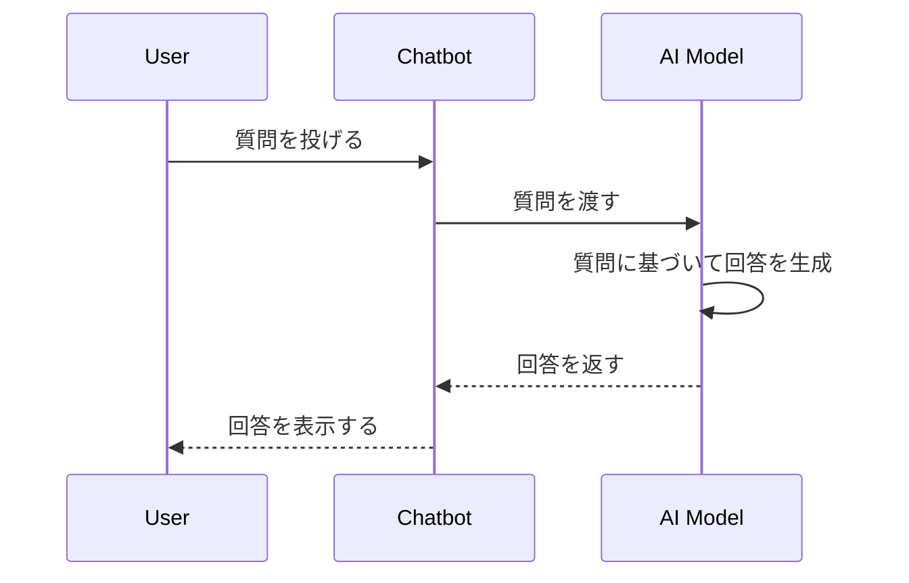

### シーケンス図の効率化

設計資料を作成する段階において、ソフトウェア設計のためのシーケンス図を作成することがあるでしょう。

イチからシーケンス図を作成するのは、時間がかかります。

そこで ChatGPT を利用して、実際のシナリオをもとにしたシーケンス図を作成することができます。

次のプロンプトを入力します。

---
### :memo: プロンプト
```text
私は生成AIを使ったアプリケーションの開発を行うエンジニアです。
marmaid 記法で生成AIを活用したChatbotのシーケンス図として、ユーザーが質問を投げてから、生成AIによる回答が得られるまでのフローを作成してください。
また、具体的なアルゴリズムや条件分岐についても記載してください。
```

### :robot: 出力例
以下は、マーメイド記法を使用して生成AIを活用したChatbotのシーケンス図を作成したものです。アルゴリズムや条件分岐についても記載しています。  
   

   
上記のシーケンス図では、以下のフローが示されています。  
   
1. ユーザーが質問をChatbotに投げます。  
2. Chatbotは受け取った質問をAI Modelに渡します。  
3. AI Modelは受け取った質問に基づいて回答を生成します。具体的なアルゴリズムや条件分岐はAI Model内部で行われます。  
4. AI Modelは生成した回答をChatbotに返します。  
5. Chatbotは受け取った回答をユーザーに表示します。  
   
このシーケンス図では、AI Modelの内部のアルゴリズムや条件分岐については具体的には示されていません。AI Modelの具体的な実装や使用するモデルによって、アルゴリズムや条件分岐は異なる可能性があります。生成AIのモデルには、例えばGPT-2やBERTなどが使用されることが一般的です。  
   
以上が、生成AIを活用したChatbotのシーケンス図とアルゴリズム・条件分岐に関する記載です。具体的な実装においては、適切なモデルやアルゴリズムを選択し、条件分岐を設計することが重要です。

