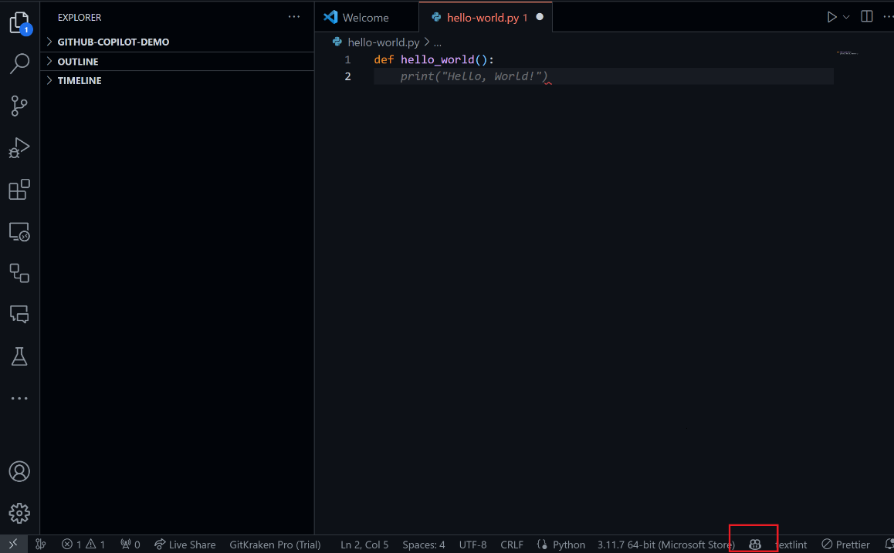

## Github Copilot について
Github Copilotは、OpenAIとGitHubが共同開発した、画期的なAIコーディングパートナーです。このツールは、開発者がコーディングしている最中にリアルタイムでコードの提案を行い、生産性を劇的に向上させることを目的としています。
Github Copilotは、OpenAI Codexという強力なAIモデルを核としています。このモデルは、一般に公開されている大量のソースコードと自然言語テキストを元に事前に学習されており、コーディングに特化しています。
Github Copilot を活用することで以下のようなことが可能です。
- コメントからコードを生成
    - コメントからコードを生成する能力を持ち、開発者が書いたコメントを基に関連するコードを提案します。
- 繰り返しコードの補完
    - 繰り返しコードの補完機能により、一貫性のあるコーディングを支援し、タイピングの負担を軽減します。
- 複数の提案オプション
    - 複数の提案オプションを提供し、開発者が適切なコードを選択できるようにします。

### Github Copilot の使い方
#### 準備するもの
- Visual Studio Code
- Github アカウント
- Copilot ライセンス

#### Github Copilot 拡張機能のインストール
Visual Studio Code の拡張機能から Github Copilot をインストールします。


#### GIthub Copilot の有効化
Github Copilot


### Github Copilot でできること

#### コードの可読性の向上
##### Before
```python
def get_speeds_and_times(speeds, times):
    avg_speed, max_acceleration = (sum(speeds) / len(speeds), max([(s2 - s1) / (t2 - t1) for s1, s2, t1, t2 in zip(speeds, speeds[1:], times, times[1:])])) if len(speeds) > 1 else (speeds[0], 0)
    return avg_speed, max_acceleration
```

###### After
```python
def get_speeds_and_times(speeds, times):
    if len(speeds) == 1:
        avg_speed = speeds[0]
        max_acceleration = 0
    else:
        avg_speed = sum(speeds) / len(speeds)
        acceleration = [(s2 - s1) / (t2 - t1) for s1, s2, t1, t2 in zip(speeds, speeds[1:], times, times[1:])]
        max_acceleration = max(acceleration)
    return avg_speed, max_acceleration
```
#### 型の追加
##### Before
```python
def estimate_fuel_consumption(distance, avg_fuel_rate):
    estimated_fuel = (distance / 100) * avg_fuel_rate
    return estimated_fuel
```

###### After
```python
def estimate_fuel_consumption(distance: float, avg_fuel_rate: float) -> float:
    estimated_fuel = (distance / 100) * avg_fuel_rate
    return estimated_fuel
```

#### バグフィックス
##### Before
```python
def monitor_battery_status(battery_voltage, battery_capacity, current_draw, total_distance_covered):
    # 電力消費を計算 (typo: correct variable name is 'battery_capacity')
    power_used = battery_voltge * current_draw  # typo: 'battery_voltage'
    
    # 現在のバッテリー充電レベルを計算
    current_charge_level = (battery_capacity - power_used) / battery_capacity * 100
    
    # 1km走行あたりの平均消費電力を計算
    avg_power_per_km = power_used / total_distance_covered  # potential bug: division by zero
    
    # 推定残り走行距離を計算
    estimated_range = (battery_capacity - power_used) / avg_power_per_km
    
    # 充電警告をチェック
    charge_warning = current_charge_level < 20  # battery needs charging if less than 20%
    
    return current_charge_level, estimated_range, charge_warning
```

###### After
```python
def monitor_battery_status(battery_voltage, battery_capacity, current_draw, total_distance_covered):
    # 電力消費を計算 (typo: correct variable name is 'battery_capacity')
    power_used = battery_voltage * current_draw  # typo: 'battery_voltage'
    
    # 現在のバッテリー充電レベルを計算
    current_charge_level = (battery_capacity - power_used) / battery_capacity * 100
    
    # 1km走行あたりの平均消費電力を計算
    avg_power_per_km = power_used / total_distance_covered if total_distance_covered > 0 else 0  # potential bug: division by zero
    
    # 推定残り走行距離を計算
    estimated_range = (battery_capacity - power_used) / avg_power_per_km if avg_power_per_km > 0 else 0
    
    # 充電警告をチェック
    charge_warning = current_charge_level < 20  # battery needs charging if less than 20%
    
    return current_charge_level, estimated_range, charge_warning
```

### Github Copilot におけるプロンプトの重要性
Github Copilotの効果を最大限に引き出すためには、プロンプトエンジニアリングが鍵となります。適切なプロンプトを設計することで、コードの出力精度が大幅に向上します。
具体的には以下のようなことをするとよいとされています。
- 指示を明確化する
- 参考を与える
- 大きなタスクを小さなタスクに分割する
- Github Copilot に思考時間を与える
- 外部のリソースを活用する

### Copilot Chat について
Copilot Chatは、GitHub Copilotの機能拡張として想定される機能です。GitHub Copilotは、コードを書く際のAI支援ツールとして開発者に提案を行いますが、Copilot Chatはこの概念をさらに進め、より対話的な形式での支援を提供することを目的としています。この機能を通じて、開発者は自然言語での質問や指示を行うことで、特定のコーディングタスクや問題解決に関するAIからの直接的な支援を受けることができます。
- チャットインターフェイスを通じて、コーディングに関する質問に対する回答を受け取る
    - チャットインターフェイスを通じて、コーディングに関する質問をCopilotに投げかけることができます。Copilotは、質問に応じて、コードの提案や説明、単体テストや修正プログラムなどを返します。
- コードの提案や説明を受け取る
    - コードの提案や説明は、エディターで開いているコードまたはエディターで強調表示したコードスニペットに基づいて生成されます。Copilotは、コードの機能や目的を自然言語で説明したり、コードの改善や最適化のための提案を行ったりします。
- 単体テストや修正プログラムを生成する
    - 単体テストや修正プログラムは、エディターで開いているコードまたはエディターで強調表示したコードスニペットに基づいて生成されます。Copilotは、コードの品質や安全性を向上させるために、単体テストのケースやコード内のバグに対する修正プログラムを提供します。


