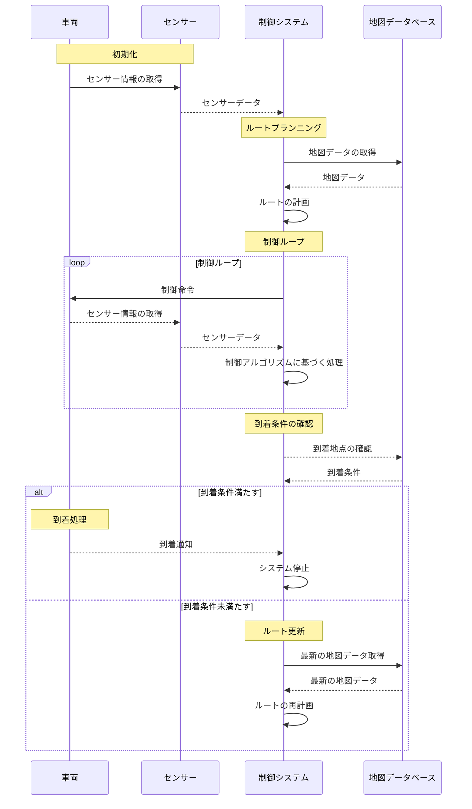

### 🚗シーケンス図の効率化

設計資料を作成する段階において、ソフトウェア設計のためのシーケンス図を作成することがあるでしょう。

イチからシーケンス図を作成するのは、時間がかかります。

そこで ChatGPT を利用して、実際のシナリオをもとにしたシーケンス図を作成することができます。

次のプロンプトを入力します。

---
### :memo: プロンプト
```text
私は自動運転車の組み込みシステムを設計するエンジニアです。
marmaid 記法で自動運転システムのシーケンス図として、自動車が出発してから到着するまでの制御フローを作成してください。
また、具体的なアルゴリズムや条件分岐についても記載してください。

participant を 車両・センサー・制御システム・地図データベース として、それぞれの役割を明確にしてください。
```

### :robot: 出力例
以下は、自動運転システムのシーケンス図の例です。マーメイド記法を使用しています。各パートには簡単な説明が付いていますが、これはあくまで概念的なものであり、実際のアプリケーションによっては異なる要素が含まれる可能性があります。また、アルゴリズムや条件分岐に関する詳細な部分は具体的な実装や使用する技術により異なります。
  


### 🚗シーケンス図からのインサイト

他の担当者が作成したシーケンス図をレビューしたり、読み解くときに、複雑で大きなシーケンス図を理解するのは容易ではありません。

そこで、ChatGPT を利用して、シーケンス図の解釈やインサイトを得ることができます。

次のプロンプトを入力します。

---
### :memo: プロンプト
```text
画像の自動運転システムのシーケンス図について、それぞれの participant がどのような役割を果たしているか、また、どのような条件分岐が含まれているかについて、インサイトを教えてください。
また、不足している可能性がある情報についても教えてください。

## 出力例

participant:
- 車両: シーケンス図の中で、車両がどのような役割を果たしているかについての説明
- センサー: シーケンス図の中で、センサーがどのような役割を果たしているかについての説明
- 制御システム: シーケンス図の中で、制御システムがどのような役割を果たしているかについての説明
- 地図データベース: シーケンス図の中で、地図データベースがどのような役割を果たしているかについての説明

条件分岐:
- シーケンス図の中で、どのような条件分岐が含まれているかについての説明

不足情報:
- シーケンス図の中で、不足している可能性がある情報についての説明
```

### :robot: 出力例
以下は、自動運転システムのシーケンス図に関するインサイトです。

車両: シーケンス図において、車両はセンサーからのデータを受け取り、制御システムと連携して動作します。車両は制御システムからの指示に基づいて運動を開始し、停止する役割を果たしています。

センサー: センサーは車両の周囲の環境データを収集し、そのデータを制御システムに送信します。これにより、制御システムは適切な指示を車両に送ることができます。

制御システム: 制御システムはセンサーからのデータと地図データベースの情報を基にして車両の動作をコントロールします。条件分岐で異なるアクションがトリガされます。

地図データベース: 地図データベースは道路や交通ルールなどの情報を提供し、制御システムが車両の動作を決定する際の参考情報として使用されます。

条件分岐: シーケンス図では、「走行可能エリア」かどうか、「障害物有無」かどうかという条件分岐が含まれています。これらはセンサーから得られた情報と地図データベースから得られた情報に基づいて評価されます。

不足情報: シーケンス図では具体的な障害物や走行可能エリアの詳細については明示されていません。また、シーケンス図には、車両の速度や加速度、ブレーキの使用などの詳細についても記載されていません。これらの情報は、シーケンス図に基づいて推測することができますが、正確性に欠ける可能性があるため、注意が必要です。

