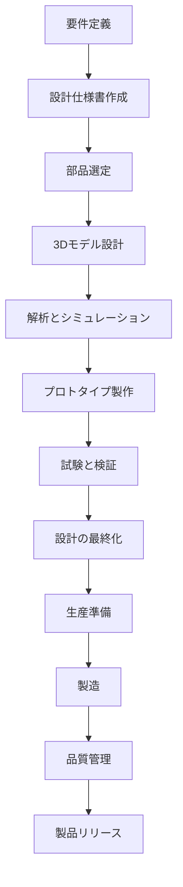

### 🚗フローチャートの作成補助

図表を書く作業は単に時間がかかるだけでなく、更新があった際の変更履歴を管理するのも多くの工数が必要になります。ここでは、フローチャートをMarkdown形式で出力するのを試してみましょう。

Markdown形式にしておくことでソースコードと同じくGitHubなどで履歴管理ができます。

--- 
### :memo: プロンプト
```text
自動車エンジンを設計する流れをフローチャートで書いて下さい。
出力はmermaidで表示できるようにしてください。
```

### :robot: 出力例
自動車エンジンの設計プロセスをMermaid形式のフローチャートで示すことはできます。以下に示すのは、高レベルの設計フローの例です。
実際の設計プロセスは、企業やプロジェクトによって異なることがあります。




このフローチャートは、自動車エンジンの設計プロセスの一般的なステップを示しています。各ステップは、特定のタスクや活動を表しており、実際のプロジェクトに合わせて詳細を追加できます。また、設計プロセスは継続的な改善と修正を経て進行することが一般的です。


出力されたフローチャートを以下のサイトで可視化してみましょう。`code`部分にChatGPTから出力されたコードを張り付けます。

[](https://mermaid.live/)

https://mermaid.live/


