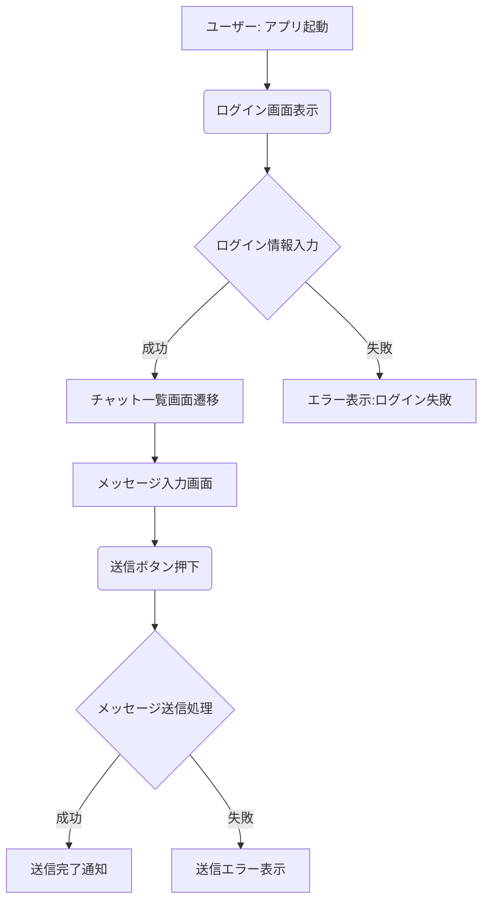
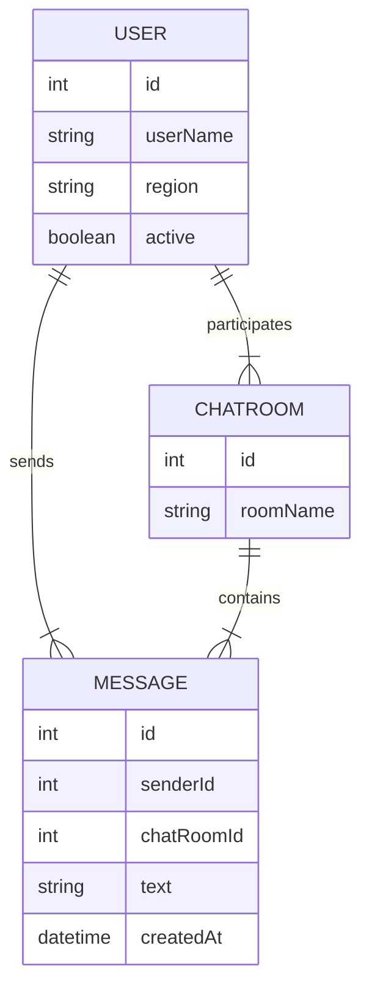

**システムの全体像**や**処理の流れ**を図解する作業は、上流工程の重要タスクのひとつです。ここでは、**メッセージングアプリ**の例を通じて、**Mermaid 記法**を使ったフロー図や ER 図の作成方法を示します。また、**GitHub Copilot** を活用して図のソースコードを自動生成するアイデアを紹介します。

---

### :pen: 例題 – フロー図（業務フロー・処理フロー）

#### 概要
1. **システムや業務の流れを図解**（アクティビティ図 / フローチャート等）  
2. **例外パターン**も洗い出して設計漏れを防ぐ  

##### プロンプト例

```text
メッセージングアプリで「ユーザーがログイン→メッセージ送信→送信完了」までのフローチャートをMermaid記法で作ってください。
例外パターン(ログイン失敗)も含めて。
```

### :robot: 出力例

```text
flowchart TD
    A[ユーザー: アプリ起動] --> B(ログイン画面表示)
    B --> C{ログイン情報入力}
    C -->|成功| D[チャット一覧画面遷移]
    C -->|失敗| E[エラー表示:ログイン失敗]

    D --> F[メッセージ入力画面]
    F --> G(送信ボタン押下)
    G --> H{メッセージ送信処理}
    H -->|成功| I[送信完了通知]
    H -->|失敗| J[送信エラー表示]
```



Copilot は**フロー図**をMermaidで生成し、**成功/失敗**の分岐やログイン失敗の例外経路を含むフローチャートを提案してくれます。

---

### :pen: 例題 – ER図（エンティティ間の関係図）

#### 概要
1. **ユースケースからエンティティを抽出** (User, Message, ChatRoom等)  
2. **Copilot** に「MermaidでER図を書いて」と頼む → **テーブル名や項目**、**リレーション**を自動提案  

##### プロンプト例

```text
下記ユースケースに基づいてER図をMermaid記法で書いてください:
- ユーザーがプロフィールを持ち、複数メッセージを送信
- 将来的にグループチャットを導入予定
- 1対1チャットの場合、User同士がMessageでつながる
```

### :robot: 出力例

```text
erDiagram
    USER ||--|{ MESSAGE : sends
    USER {
        int id
        string userName
        string region
        boolean active
    }
    MESSAGE {
        int id
        int senderId
        int chatRoomId
        string text
        datetime createdAt
    }
    CHATROOM ||--|{ MESSAGE : contains
    CHATROOM {
        int id
        string roomName
    }
    USER ||--|{ CHATROOM : participates
```



Copilot は**User** と **Message**, **ChatRoom** の各エンティティ・リレーションをER図として表示し、**1対多** や **多対多** の関係をMermaidソースで示してくれます。

---

### :memo: 練習

1. **別の例外経路を加えてフロー図を修正**  
   - 「メッセージ送信の際、画像添付がある場合の分岐」をMermaidに追加させる  
2. **ER図の属性を増やす**  
   - 「Messageに既読フラグを追加」「Userに最終ログイン日時を追加」などを指定して、Copilotの提案を更新  
3. **大きな図を分割**  
   - フローが複雑すぎる場合、Copilotに「フロー図を2つに分けて描いて」と頼むとどうなるか試す

---

## まとめ

- **Mermaid記法**を活用すると、**フロー図**や**ER図**をテキストベースで作成しやすい  
- **Copilot** に「Mermaidでフローチャート (or ER図)を書いて」と指示すると、**初稿**を提案 → 微調整して完成度を上げる  
- **業務フロー**や**データモデル**を可視化しながら上流工程を進めることで、**設計漏れ**の早期発見に役立つ  

こうした**図**の作成も Copilot が部分的に支援してくれることで、上流工程の**効率**と**品質**を高められます。