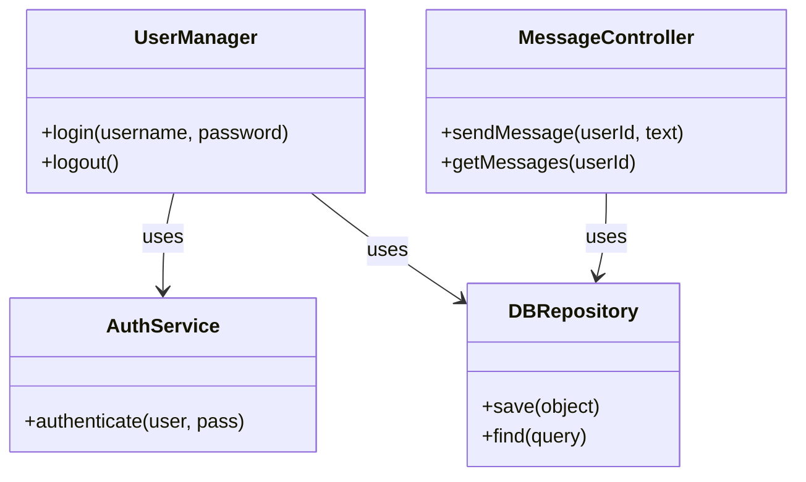
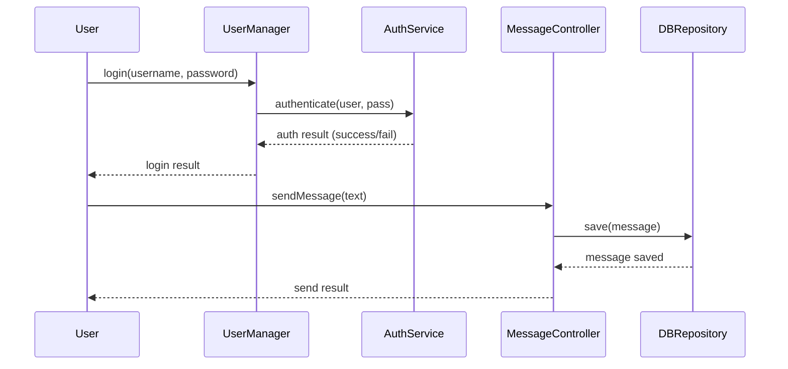

**クラス間の関連や継承関係**、または**処理の流れ**を可視化する際、**UML 図**が役立ちます。ここでは、**Mermaid 記法**を使って **クラス図**や **シーケンス図**を作成し、さらに **Copilot** を活用して図のソースコードを自動生成する方法を紹介します。

---

### :pen: 例題 – クラス図の作成

以下では、**メッセージングアプリ**を題材にして **クラス図** を描く例を示します。たとえば、`UserManager`, `AuthService`, `MessageController`, `DBRepository` などを登場させ、どう関連し合うかを Mermaid で表現します。

#### プロンプト例

```text
メッセージングアプリで以下のクラスを使った UMLクラス図を Mermaid記法で作ってください:
- UserManager: login(), logout()
- AuthService: authenticate()
- MessageController: sendMessage(), getMessages()
- DBRepository: save(), find()

UserManagerはAuthServiceとDBRepositoryを利用、
MessageControllerはDBRepositoryを利用。
継承は特にない。
```

### :robot: 出力例

```text
classDiagram
    class UserManager {
        +login(username, password)
        +logout()
    }
    class AuthService {
        +authenticate(user, pass)
    }
    class MessageController {
        +sendMessage(userId, text)
        +getMessages(userId)
    }
    class DBRepository {
        +save(object)
        +find(query)
    }

    UserManager --> AuthService : uses
    UserManager --> DBRepository : uses
    MessageController --> DBRepository : uses
```



Copilot が**クラス名・メソッド**を読み取り、**クラス図**の初稿を提示してくれます。`-->` は「依存関係(uses)」を示す矢印として使われています。

---

### :pen: 例題 – シーケンス図の作成

次に、ユーザーがログインしてメッセージを送信する一連の処理を、**シーケンス図**で可視化してみましょう。

#### プロンプト例

```text
Mermaidのシーケンス図で、ユーザーがログイン→メッセージ送信する流れを書いてください。
登場オブジェクト: User, UserManager, AuthService, MessageController, DBRepository
```

### :robot: 出力例

```text
sequenceDiagram
    participant U as User
    participant UM as UserManager
    participant AS as AuthService
    participant MC as MessageController
    participant DB as DBRepository

    U->>UM: login(username, password)
    UM->>AS: authenticate(user, pass)
    AS-->>UM: auth result (success/fail)
    UM-->>U: login result

    U->>MC: sendMessage(text)
    MC->>DB: save(message)
    DB-->>MC: message saved
    MC-->>U: send result
```



Copilot は**やりとりオブジェクト**（User, UserManager, AuthServiceなど）を参加者として記述し、それぞれの**呼び出し**を矢印で示す形でシーケンス図を生成します。

---

### :memo: 練習

1. **追加パターン**  
   - メッセージ送信で添付ファイルがある場合をシーケンス図に加える → Copilotがどう拡張するか  
2. **細かいクラス構造**  
   - クラス図で「MessageController に private メソッドがある」など詳細を追加指示してみる  
3. **大規模図を2つに分割**  
   - フローが大きすぎるなら「図を2つに分けて作成して」と依頼し、Copilotの提案を確認

---

## まとめ

- **Mermaid 記法** だけで、**クラス図**や**シーケンス図**をテキストとして表現可能  
- **Copilot** に「UML 図を作って」と頼むと、**初稿**を自動生成してくれる → そこから**手動で微調整**  
- フローが複雑な場合は**複数の図**に分けるなどの工夫が必要  

こうした **UML 図** の自動生成も、**Copilot** で初稿を作れば作業時間を削減でき、**上流工程**の可視化や合意形成が進みやすくなります。